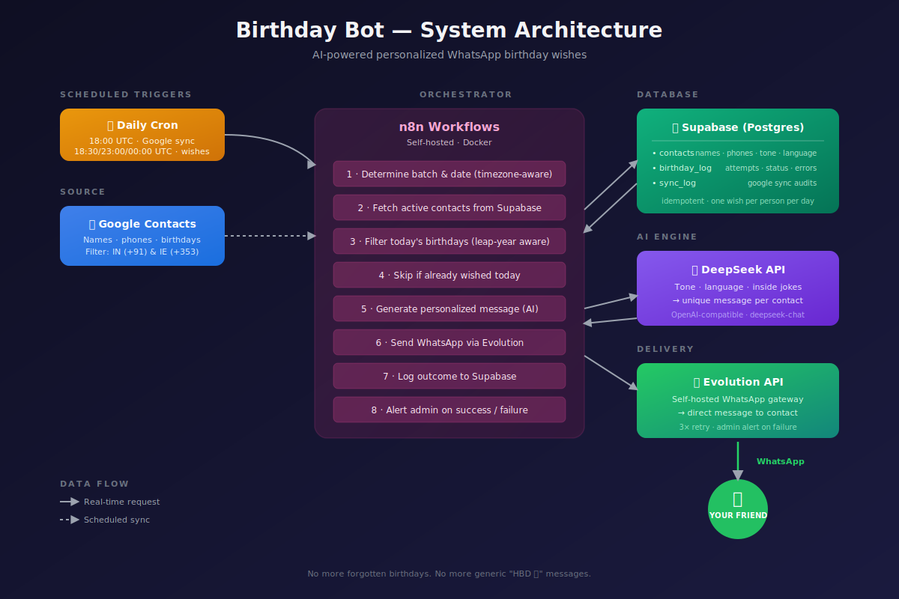
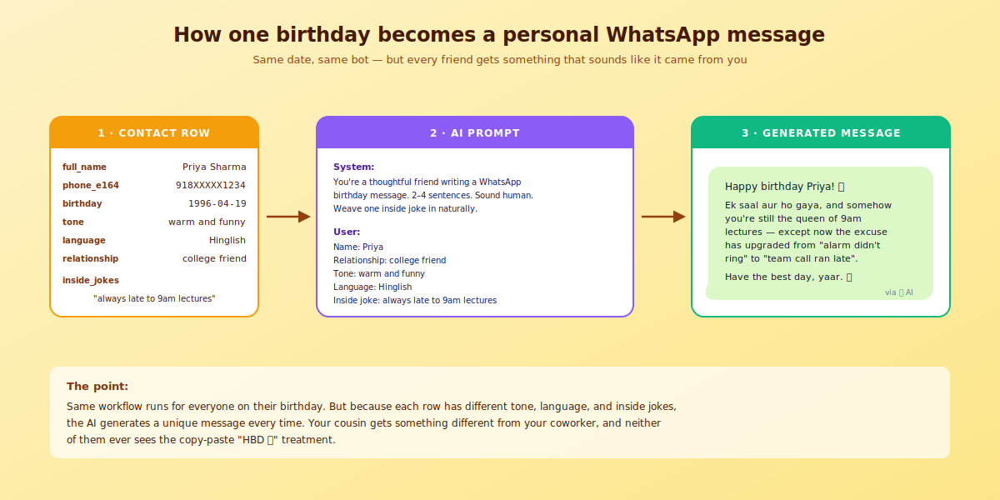

# 🎂 Birthday Bot

> An AI-powered automation that sends personalized WhatsApp birthday wishes to your friends and family — so you never forget, and no two messages sound alike.



---

## The story behind this

I used to forget birthdays. A lot of them.

And on the rare occasion I did remember, I'd type out a rushed *"Happy birthday! 🎉"* that looked identical to every other one I'd sent that year. Friends would message back surprised I'd even remembered — which honestly said more about my track record than anything else.

So I built this. Not to automate caring, but to make sure that when the date comes around, the people who matter actually get something that sounds like it came from **me** — with the tone, the language, and even the inside jokes that only make sense between us.

Now birthdays take care of themselves. And every message feels personal, because it is.

---

## ✨ What it does

- 📇 **Auto-syncs contacts from Google** every day — just add someone to your phone and they're in
- 🌍 **Timezone-aware** — wishes land at 00:00 *in the recipient's timezone*, not yours
- 🤖 **AI-generated, unique every time** — no two messages are the same, even for the same person across years
- 🗣️ **Multi-lingual** — Hinglish, Kanglish, Irish English, whatever you want per contact
- 🧩 **Inside jokes baked in** — store shared memories per person; the AI weaves them in naturally
- 🛡️ **Idempotent** — runs multiple times a day safely, each contact gets exactly one wish
- 🚨 **Self-monitoring** — admin alert on WhatsApp if anything fails

---

## 🔁 How it works



Every day, three cron jobs wake up the workflow (one per timezone window). The flow:

1. Figure out which country's batch is running and what today's date is in that timezone
2. Pull active contacts from Supabase for that country
3. Filter down to only people whose birthday is today (with leap-year fallback — Feb 29 babies get wished on Mar 1 in non-leap years)
4. Check the log: have we already wished this person today? If yes, skip
5. Build a DeepSeek prompt using their tone, language, relationship, and inside jokes
6. Send the generated message through Evolution API → WhatsApp
7. Log the outcome. On failure, retry 3× then alert admin

A separate daily job syncs contacts from Google so you never have to maintain the list manually.

---

## 🛠 Tech Stack

| Layer | Tool | Why |
|---|---|---|
| Orchestration | [**n8n**](https://n8n.io) (self-hosted) | Visual workflows, easy to modify, runs the schedule |
| Database | [**Supabase**](https://supabase.com) | Postgres with a nice UI, free tier is plenty |
| AI | [**DeepSeek**](https://www.deepseek.com) | OpenAI-compatible API, dramatically cheaper per message |
| WhatsApp | [**Evolution API**](https://github.com/EvolutionAPI/evolution-api) | Self-hosted WhatsApp gateway, no meta business approval needed |
| Contacts | **Google People API** | Source of truth for phone numbers & birthdays |

**All self-hostable. No vendor lock-in. Typical cost: free tier on Supabase, cents per month on DeepSeek, whatever your server costs to run n8n + Evolution.**

---

## 📸 Demo

> *Screenshots / short video go here — add your own once you've set it up*

<!-- Suggested screenshots to add:
1. The n8n canvas showing the full workflow
2. A real (or dummy) WhatsApp screenshot of a generated message
3. The Supabase contacts table
-->

---

## 🚀 Installation

### Prerequisites

You'll need:
- A server running Docker (DigitalOcean, Hetzner, a home lab, anything)
- A [Supabase](https://supabase.com) account (free tier works)
- A [DeepSeek API key](https://platform.deepseek.com) (or swap for OpenAI / Anthropic — the Generate Message node is a plain HTTP Request)
- A spare WhatsApp number you can dedicate to the bot
- A Google Cloud project with People API enabled + OAuth credentials

### Step 1 — Deploy n8n and Evolution API

The easiest path is [Coolify](https://coolify.io), [Dokploy](https://dokploy.com), or [Easypanel](https://easypanel.io) — all one-click deploy both of these. Or use the official Docker images directly.

Make sure Evolution API has an `AUTHENTICATION_API_KEY` environment variable set (you'll need this value later).

### Step 2 — Set up the Supabase schema

1. Create a new Supabase project
2. Open the **SQL Editor**
3. Paste the contents of [`schema.sql`](./schema.sql) and run it

This creates three tables: `contacts`, `birthday_log`, `sync_log`.

### Step 3 — Connect WhatsApp to Evolution

1. Open your Evolution Manager at `https://your-evolution-url/manager`
2. Log in with your Global API Key
3. Create a new instance (give it any name — remember it)
4. Scan the QR code with WhatsApp on the phone you're dedicating to the bot
5. Once it says "Connected", copy the instance API key

### Step 4 — Import the workflows

1. In n8n, click **Workflows → Import from File**
2. Import [`workflows/Birthday-Bot.json`](./workflows/Birthday-Bot.json)
3. Import [`workflows/Google-Contacts-Sync.json`](./workflows/Google-Contacts-Sync.json)

### Step 5 — Replace the placeholders

Search each imported workflow for these placeholders and replace them with your real values:

| Placeholder | Where to get it |
|---|---|
| `YOUR_SUPABASE_PROJECT.supabase.co` | Supabase → Settings → API → Project URL |
| `YOUR_SUPABASE_SERVICE_ROLE_KEY` | Supabase → Settings → API → `service_role` (click reveal) |
| `YOUR_DEEPSEEK_API_KEY` | [platform.deepseek.com](https://platform.deepseek.com) → API Keys |
| `YOUR_EVOLUTION_API_KEY` | The global API key you set in Evolution |
| `your-evolution-instance.example.com` | Your Evolution API base URL |
| `YOUR_INSTANCE_NAME` | The instance name you created in Evolution |
| `353XXXXXXXXX`, `91XXXXXXXXXX` | Admin phone numbers (E.164, no `+`) |

### Step 6 — Connect Google Contacts

In the **Google-Contacts-Sync** workflow, click the Google Contacts node and set up OAuth2 credentials:
1. In Google Cloud Console, enable the **People API**
2. Create OAuth 2.0 credentials (type: Web application)
3. Set the redirect URI to the one n8n gives you
4. In n8n, paste your Client ID and Client Secret and authorize

### Step 7 — Add personalization

After the first Google sync runs, your Supabase `contacts` table fills up. Open it and fill in the fields that make the messages feel personal:

- `tone` — e.g. *"warm and funny"*, *"heartfelt and nostalgic"*, *"dry and sarcastic"*
- `language` — e.g. *"Hinglish"*, *"Irish English"*, *"Kanglish"*, *"formal English"*
- `relationship` — e.g. *"cousin"*, *"college friend"*, *"work mentor"*
- `inside_jokes` — free text; any memory, phrase, or running joke you share

This is the secret sauce. Five minutes of personalization per important contact pays dividends every year.

### Step 8 — Activate both workflows

Flip the toggle at the top-right of each workflow. You're live. 🚀

---

## ⏰ Schedule

The workflow runs on three UTC crons, tuned to hit midnight in supported timezones:

| Time (UTC) | Triggers | Covers |
|---|---|---|
| 18:00 | Google Contacts sync | All contacts |
| 18:30 | Birthday wishes | 00:00 IST (India) |
| 23:00 | Birthday wishes | 00:00 IE summer (DST) |
| 00:00 | Birthday wishes | 00:00 IE winter |

Idempotency guarantees mean running the job twice never sends two messages — even if the cron overlaps during DST changes.

---

## 🏗 Project structure

```
birthday-bot/
├── workflows/
│   ├── Birthday-Bot.json              # Main daily workflow
│   └── Google-Contacts-Sync.json      # Auto-sync from Google
├── docs/
│   ├── architecture.svg               # System architecture diagram
│   └── data-flow.svg                  # Example: contact → message
├── schema.sql                         # Supabase tables
├── .gitignore
├── LICENSE
└── README.md
```

---

## 🎯 The outcome

- **Zero forgotten birthdays** for anyone on the list
- **Every message is unique** — I've compared messages sent to the same person a year apart, they're always different
- **People genuinely can't tell it's automated** — and that's the point. It's not a replacement for caring, it's a safety net that makes sure caring actually reaches them
- **Runs on autopilot** — the last time I touched this was to add a new friend. Add them to Google Contacts with a birthday, and next year they get wished

---

## 🤝 Contributing

PRs welcome. Things I'd love help with:
- Support for more countries / timezones (currently just IN + IE)
- Slack / Telegram / Discord adapters alongside WhatsApp
- A tiny web UI for filling in tone/language/inside_jokes (right now it's raw Supabase table edits)
- Anniversary wishes, not just birthdays

---

## 📜 License

[MIT](./LICENSE) — do whatever you want with it. If you build something cool on top, I'd love to hear about it.

---

## 🙏 Credits

Built with [n8n](https://n8n.io), [Supabase](https://supabase.com), [DeepSeek](https://www.deepseek.com), and [Evolution API](https://github.com/EvolutionAPI/evolution-api). Huge thanks to the open source communities behind each.

---

<p align="center">
  <em>Because the people who matter deserve better than "HBD 🎉".</em>
</p>
